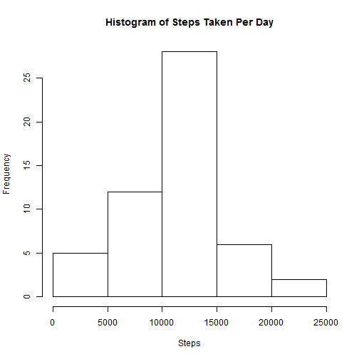

#Peer Assessment 1


###Loading and preprocessing the data

* First we need to load the activity data that we will be analyzing

```r
# Read data using read.csv()
data <- read.csv("activity.csv", na.strings=c("NA"))
```

###What is the mean total number of steps taken per day?

* Calculate the total number of steps taken per day:

```r
# Remove NA values
data <- data[is.na(data$steps)==0,]

# Summarize steps by day using plyr library
dailySteps <- ddply(data, .(date), summarize, steps=sum(steps))
```

* Histogram of steps taken per day:

 

* Calculate the mean and median of the total steps taken per day


```r
# Calculate mean of steps taken per day
meanDailySteps <- format(round(mean(dailySteps$steps), digits=2), nsmall=2)

# Calculate median of steps taken per day
medianDailySteps <- as.integer(median(dailySteps$steps))
```

* The mean for daily steps = 10766.19
* The median for daily steps = 10765

###What is the average daily activity pattern?

* Calculate the average number of steps taken per 5 minute interval

```r
# Summarize steps per interval
intervalSteps <- ddply(data, .(interval), summarize, steps=mean(steps))
```

* Plot of average number of steps taken per interval
 


* The 5 minute interval with the highest average number of steps is **835** with an average of **206.1698113 steps**.

###Imputting missing values

* Let's load up all the data again including the missing values:

```r
# Read data using read.csv()
data <- read.csv("activity.csv", na.strings=c("NA"))
```

* Let's find all of the missing values

```r
# Find the incomplete cases and count
nrow(data[complete.cases(data)==0,])
```

```
## [1] 2304
```

* Now let's get the mean per interval to replace the missing values

```r
# Calculate the mean per interval
meanStepsPerInterval <- ddply(data[complete.cases(data),], .(interval), summarize, meanSteps=mean(steps))

# Merge data frames
data <- merge(data, meanStepsPerInterval, by.x="interval", by.y="interval")

# Set steps to meanSteps where steps is NA
data[is.na(data$steps),]$steps <- data[is.na(data$steps),]$meanSteps

# Summarize steps by day using plyr library
newDailySteps <- ddply(data, .(date), summarize, steps=sum(steps))
```

* Here's a histogram of the data set with the missing values replaced:
 

* Calculate the mean and median of the total steps taken per day for the new data set:


```r
# Calculate mean of steps taken per day
newMeanDailySteps <- format(round(mean(newDailySteps$steps), digits=2), nsmall=2)

# Calculate median of steps taken per day
newMedianDailySteps <- as.integer(median(newDailySteps$steps))
```

* The new mean for daily steps = 10766.19. The previous value was 10766.19. This is a difference of 0
* The new median for daily steps = 10766. The previous value was 10765. This is a difference of -1

Replacing the missing values with the mean for the same interval does not appear to significantly affect the results.

###Are there differences in activity patterns between weekdays and weekends?
* Figure out which days are weekends

```r
# Convert date field to POSIXlt data type
data$date <- as.POSIXlt(data$date)

# Add weekend variable
data$weekend <- ifelse(data$date$wday %in% c(0, 6), "Weekend", "Weekday")

# Summarize data by weekend vs weekday
sumData <- ddply(data, c("interval", "weekend"), summarize, meanSteps=mean(steps))
```

* Graph data

```r
library(lattice)
xyplot(data$steps ~ data$interval | data$weekend, layout = c(1,2), type="l", xlab="Interval", ylab="Steps")
```

 
